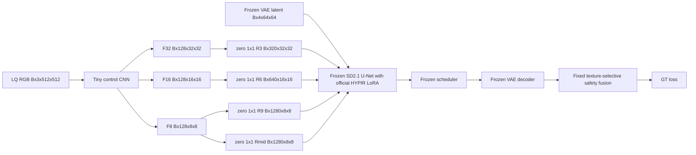

# CSIG LoRA / Adapter training feasibility audit

> 审计日期：2026-09-02。仅检查本地代码、checkpoint、环境和已有实验；未下载数据、训练模型或修改 HYPIR / 实验代码。

## 最终决定

### GO：只做一个 5 天内可证伪的轻量 Adapter MVP

不启动官方 HYPIR 训练，不训练 LoRA，不建大型 ControlNet。启动一个约 0.94M 参数的 Spatial residual Adapter，最多训练 30k patch；Day 1、Day 2 或 Day 5 任一硬门槛失败，立即回退当前 `texture_selective_h200`。

| 判断项 | 结论 | 证据 |
|---|---|---|
| RTX 5080 Laptop 16 GB | **大概率可运行，batch 1** | HYPIR bf16、512 tile 推理已测 3.994 GiB allocated；MVP 只新增约 0.94M 参数。训练峰值未测，须 Day 1 确认。 |
| 代码接入 | **可行但需要独立 wrapper** | 本机 Diffusers 0.32.2 的 U-Net 原生支持 additional residual；HYPIR 当前调用未传这些参数。 |
| 12 天赛程 | **足够 MVP，不够宽泛研究** | 512 crop、B1、累计 4 的 30k patch 预计 9.6--24.0 小时纯训练加运行开销；Day 9 起保留提交缓冲。 |
| 技术价值 | **明确不同于现有 fusion** | 由 LQ 在 U-Net feature space 生成空间多尺度控制，不再只在已生成 RGB 图间启发式混合。 |
| 主要风险 | **synthetic-to-real 域偏移** | 使用同分辨率温和退化、identity anchor、固定 safety fusion 和 Day 5 real gate。 |

GO 的含义是“值得做一次受控验证”，不是“理论上可能有效”或“保证提升比赛分数”。已失败的 image-space control v1 为 `28.231809 / 0.776624 / 0.158292`，低于当前 `texture_selective_h200` 的 `28.480280 / 0.781421 / 0.164546`；这正说明需要把控制放入冻结 U-Net，而不能继续调 RGB alpha。

## 本地 HYPIR 代码结论

| 项目 | 位置与审计事实 |
|---|---|
| SD2.1 U-Net | `HYPIR/models/stable-diffusion-2-1-base/unet/`；`HYPIR/HYPIR/enhancer/sd2.py:21` 的 `UNet2DConditionModel.from_pretrained()` 加载。 |
| 官方 HYPIR LoRA | `HYPIR/weights/HYPIR_sd2.pth`；`sd2.py:23-37` 调用 `add_adapter()`、加载权重并断言所有 LoRA key 匹配，随后冻结整个 U-Net。 |
| LoRA 覆盖范围 | `configs/sd2_train.yaml:76-77`：rank 256，覆盖 attention `to_q/to_k/to_v/to_out.0`、FFN projection、卷积和 residual projection。checkpoint 只读清点为 514 tensors、257 个 LoRA 层对、259,474,432 fp32 参数，存在于全部 down/up block、mid block 和 `conv_out`。 |
| 推理路径 | `sd2.py:56-65`：LQ latent -> U-Net/LoRA `eps` -> `scheduler.step(..., coeff_t)`。`enhancer/base.py:117-153` 对 VAE encode、U-Net、VAE decode 做 tile，并进行 `wavelet_reconstruction`。 |
| 推理入口 | `HYPIR/test.py`；比赛已运行 `model_t=200, coeff_t=200, patch_size=512, stride=256, upscale=1`。 |

冻结 SD2.1、官方 LoRA、VAE 和 text encoder，只训练新 Adapter 在代码上可行。官方 `SD2Trainer` 不可直接复用：它重新创建可训练 LoRA，且 `trainer/base.py:125-145,279-310` 额外训练 ConvNeXt discriminator 和 VGG-LPIPS。两者都不应进入本 MVP。

官方 `sd2_train.yaml` 的 Real-ESRGAN 退化也不应照搬：它包含 `stage2_scale: 4`、resize 下界 0.15、noise 到 30、JPEG 到 quality 30（`sd2_train.yaml:52-68`），与本赛题同分辨率、低改写 restoration 不匹配。

### 可注入的 U-Net block

本机 U-Net forward 已确认有：

```python
down_block_additional_residuals: Optional[Tuple[torch.Tensor]]
mid_block_additional_residual: Optional[torch.Tensor]
```

对 512x512 crop 做 meta-device forward 的精确形状如下。VAE latent 是 `[B,4,64,64]`；residual tuple 共 12 个 down-skip slot，但 MVP 只向三个 slot 和 mid block 注入，其他以零 tensor 填充。

| tuple 下标 | 对应 skip | shape | 选择理由 |
|---:|---|---|---|
| 3 | `down_blocks.0` downsample output | `[B,320,32,32]` | 局部模糊和非语义细节的细尺度控制。 |
| 6 | `down_blocks.1` downsample output | `[B,640,16,16]` | 中尺度纹理/压缩控制。 |
| 9 | `down_blocks.2` downsample output | `[B,1280,8,8]` | 大范围退化与 decoder skip 控制。 |
| mid | `mid_block` | `[B,1280,8,8]` | 在 decoder 前控制主干 feature。 |

不使用 Python forward hook 改写 hidden state，也不复制完整 ControlNet。原生 residual API 可以保持未注入路径数值不变，并避免 fork HYPIR。

## 数据方案

### 推荐数据集与划分

不下载数据集作为本次审计的一部分。未来下载前应核实许可证。

| 优先级 | 数据集 | 作用 | 决定 |
|---|---|---|---|
| 1 | **DF2K training source**：DIV2K train 800 与 Flickr2K 2,650 | 高质量自然图像，3,450 张即可提供大量在线随机 crop | MVP 唯一必需数据源。 |
| 2 | DIV2K validation 100 | 独立 synthetic test | 不进训练，也不参与早停。 |
| 3 | LSDIR | 规模化扩展 | 只在 Day 5 通过后考虑。当前 D: 剩余 107.27 GiB，不在比赛中期引入其大下载和清洗风险。 |
| 4 | COCO / Open Images 的已许可高分辨率子集 | 后续增加内容多样性 | 不替代 DF2K；分辨率和质量更杂。 |

以**源图 ID**固定 `85% / 10% / 5%` train / synthetic-validation / synthetic-test。一个 source 图的所有 crop 及所有 degradation seed 只能在一个 split。5 对 CSIG GT/LQ 永不训练；100 张无 GT 测试图不调参。

三层验证：synthetic-validation 使用固定 crop 和 seed 早停；synthetic-test 从未见 source 只报告一次；CSIG 5 对 real validation 只比较预登记 checkpoint，不反传梯度、不按 case 调参。

### 10k、30k、50k patches 的含义

patch 是一次 512x512 optimizer exposure，不预先写出静态 patch 文件。使用在线随机 crop 与可复现 degradation seed。

| 训练 patch | 配套 synthetic val/test | B1、accumulate 4 的 update | 含义 | 决策 |
|---:|---:|---:|---|---|
| 10k | 1k / 1k | 2,500 | 显存、梯度、overfit 和首个 real 趋势检查；不能证明泛化。 | Pilot。 |
| **30k** | 3k / 3k | 7,500 | 对内容、位置和退化有基本覆盖。 | 推荐 MVP 上限。 |
| 50k | 5k / 5k | 12,500 | 合成分布更稳，但挤压提交缓冲。 | 仅 Day 5 gate 通过后。 |

### 同分辨率 synthetic degradation pipeline

顺序固定为 `GT crop -> optional blur -> optional down/up sample -> optional noise -> optional JPEG -> LQ`，输出仍为 512x512。绝不使用默认 4x second stage。

| 类型 | 条件概率与范围 | 备注 |
|---|---|---|
| identity anchor | 10%，LQ=GT | 约束 Adapter 不把每处都当成应生成纹理。 |
| Gaussian / anisotropic blur | 35%，sigma 0.2--1.8 px，ratio 1.0--3.0，随机角度 | mild bucket 限制 sigma 不超过 1.0。 |
| motion blur | 20%，kernel 3--13 px，角度 0--180 度 | hard 的 5% 样本才允许到 17 px。 |
| downsample then restore | 55%，scale 0.60--1.00，area/bilinear/bicubic | mild 用 0.75--1.00，立即恢复原 size。 |
| Gaussian 或 Poisson noise | 30%，Gaussian sigma 0--10/255 | hard 才允许到 15/255。 |
| JPEG | 45%，quality 55--100，偏重 75--100 | 最后执行，避免 block artifact 主导训练。 |
| 轻微颜色变化 | 15%，brightness/contrast/saturation 0.90--1.10 | 覆盖可见色差，但非主任务。 |

样本配方：10% identity、35% 单一操作、45% 两到三种温和 mixed、10% hard mixed。避免真实分布错配的措施：

- 对 5 对 real validation 做只读梯度/Laplacian 能量、颜色、噪声残差、JPEG block proxy 对比，只确认 synthetic 覆盖范围，不拟合每张图的专用参数。
- synthetic-validation 分别保留单退化与 mixed 子集，不能只看平均值。
- 不对高纹理 crop 过采样。现有鸟类和绿植证据显示 HYPIR 容易生成错误高频。
- manifest 固定 recipe 与 seed；最多基于整体统计一次性重配 mix，禁止按 case1--case5 反复调参。

## Adapter 架构

| 候选 | 结构 | 参数量 | 优点 | 风险 | 选择 |
|---|---|---:|---|---|---|
| A. Spatial residual adapter | LQ RGB -> 小 CNN -> 多尺度 zero-conv -> down/mid residual | 约 0.94M | 直接学习何处抑制或允许 HYPIR 改写；无退化标签依赖；零初始化安全。 | synthetic 空间模式仍可能偏移。 | **MVP**。 |
| B. Degradation-aware gain adapter | LQ -> global encoder `[B,128]` -> MLP/FiLM 输出尺度 gain，再调制 residual | 约 0.3--1.2M | 可分析 blur/noise/JPEG 条件。 | 全局码无法定位文字/钟表；synthetic label 不等于真实退化。 | A 有正信号后再做。 |

### 推荐：Spatial residual adapter



CNN 为六个 `3x3, stride=2, Conv + GroupNorm + SiLU` stage：`3 -> 32 -> 64 -> 96 -> 128 -> 128 -> 128`，空间 `512 -> 256 -> 128 -> 64 -> 32 -> 16 -> 8`。四个 projection 为 `128->320`、`128->640`、`128->1280`、`128->1280`。按此定义，Conv、GroupNorm、projection 合计约 **935,904 trainable parameters**。

四个 output projection 的 weight/bias 均零初始化。因此训练前所有 residual 为零，U-Net 的结果严格等于已加载的官方 HYPIR LoRA。需要 ControlNet-style zero convolution；不需要新的 cross-attention，因当前推理 prompt 为空且退化空间位置已包含在 LQ 中。

Adapter 学的是 **degradation-conditioned restoration control field**，不是独立 RGB restoration 网络：它依据 LQ 的局部模糊、压缩、噪声和结构证据，向冻结 U-Net 的多尺度 feature 提供 residual。监督来自最终 restoration image，因此会间接学习恢复；但可训练输出始终是 feature-space control。

## 训练目标

固定 `model_t=200, coeff_t=200`，即当前 HYPIR-200 强生成路径。为了让零 Adapter 与现有最佳严格对齐，loss 使用固定安全融合后的图像：

```text
h_adapter = frozen_HYPIR(LQ, adapter_residuals)
x_hat = LQ + M_texture(LQ) * (h_adapter - LQ)
```

`M_texture` 是当前固定的 LQ-only `texture_selective_h200` map，不训练也不调阈值。训练和报告都保存 direct `h_adapter` 与 fused `x_hat`，分别检查内控能力和提交候选。

```text
Loss = Charbonnier(x_hat, GT, epsilon=1e-3) + 0.05 * LPIPS-Alex(x_hat, GT)
```

前 100 update 记录两项未加权量；LPIPS 应占总 loss 的约 5--20%，失衡时只允许一次全局调整 0.05。选择这个最小目标的原因：

- 需要 restoration image loss，因为这是 Adapter 到 GT 的唯一直接低风险信号。
- 不需要 diffusion noise-prediction loss，diffusion prior、LoRA、scheduler 都冻结，目标是最终 restoration。
- 不加 edge/frequency loss；现有失败正是错误高频和结构重绘，额外锐化约束风险更大。
- 不用 GAN / discriminator；它增加显存和不稳定性，与少改写目标相反。

VAE、text encoder、U-Net、官方 LoRA 的参数全部冻结。LQ VAE encode 和 empty-prompt text encode 可以 `no_grad()`；decoder 参数虽冻结，但 decoder forward 不能 `no_grad()`，否则 GT loss 无法把梯度送回 Adapter。

## RTX 5080 16 GB 预算

已核对：RTX 5080 Laptop `15.920 GiB`、compute capability 12.0、bf16 supported；项目 `.conda` 是 PyTorch `2.11.0+cu128`、CUDA build `12.8`、Diffusers `0.32.2`、Accelerate `1.4.0`、PEFT `0.14.0`、Transformers `4.49.0`。

| 配置 | MVP 值 | 原因 |
|---|---|---|
| precision | bf16；fp16 仅 fallback | 本机显式支持 bf16。 |
| crop / batch | 512x512 / 1 | 对齐现有 tile，先不假定 batch 2。 |
| accumulation | 4 | 有效 batch 4，限制即时 activation。 |
| checkpointing | U-Net decoder 必开 | 以额外计算换显存。 |
| optimizer | AdamW，betas `(0.9,0.999)`，wd `0.01` | 0.94M 参数无需 8-bit optimizer。 |
| learning rate | `1e-4`，500 update warmup，cosine 到 `1e-5` | 零初始化小 Adapter；绝不更新 LoRA。 |
| perceptual net | LPIPS-Alex | 不加载官方 VGG-LPIPS。 |

唯一已测显存是 HYPIR inference：B1、512 tile、bf16 的峰值为 **3.994 GiB allocated / 4.936 GiB reserved**。下面是有明确假设的训练规划区间，不是训练实测。

| 组成 | 估算峰值 |
|---|---:|
| 已加载冻结模型与 inference workspace | 约 4.0 GiB，实测基线 |
| Adapter 参数、梯度、AdamW 状态 | 小于 0.05 GiB |
| U-Net decoder / VAE decoder autograd activation | 约 5.5--8.0 GiB |
| Alex LPIPS、临时 tensor、fragmentation | 约 0.8--2.0 GiB |
| **合计** | **约 10.3--14.1 GiB allocated；reserved 约 12--15.5 GiB** |

Day 1 用 20 次 512/B1 forward/backward 记录 `max_memory_allocated/reserved` 和 `t_iter`。若 reserved 超过 14.7 GiB 或 OOM：先确认没有 D/VGG/LoRA optimizer，再保持 B1、开启 checkpointing、crop 降到 448、短暂移除 LPIPS 做连通性检查。448 仍不能稳定完成 20 次则转 **NO-GO**。

速度只能以公式而非 4K inference 外推。以 `t_iter=1.0--2.5 s` 的 512 crop microbatch 包络：每小时 `1,440--3,600` patch，或 `360--900` optimizer update（累计 4）。

| patch exposure | optimizer update | 纯训练估算 | 加约 15% 日志/checkpoint |
|---:|---:|---:|---:|
| 10k | 2.5k | 2.8--6.9 h | 3.2--8.0 h |
| 30k | 7.5k | 8.3--20.8 h | 9.6--24.0 h |
| 50k | 12.5k | 13.9--34.7 h | 16.0--40.0 h |

Day 1 实测后以 `3600 / t_iter` 重算。若吞吐低于 1,000 patch/hour，不追求 50k。

## 12 天与 stop gates

| 时间 | 工作 | 必须结论 |
|---|---|---|
| Day 1 | 核对 DF2K 许可/空间，建 manifest 和 1k degraded sample；独立 wrapper 做 20 次 forward/backward 探针。 | 512/B1/bf16 稳定，reserved 不高于 14.7 GiB，projection 有非零梯度。否则 448；仍失败停止。 |
| Day 2 | 32 patch 固定 crop/seed overfit，再跑 10k Pilot。 | Charbonnier 明显下降、无 NaN、zero Adapter 与当前 baseline 数值一致。当天无法通过停止。 |
| Day 3--4 | 固定 recipe 训练 30k patch；每 1k update 验证 synthetic-validation，最多保存 3 个登记 checkpoint。 | synthetic validation 不退化，未出现系统性文字/强边缘重绘。 |
| Day 5 | 一次 synthetic-test 与 5 对 CSIG real validation。 | 通过 real gate 才扩展，否则停止并回退 baseline。 |
| Day 6--8 | 仅在通过后扩到 50k 或一次全局 mix 修订。 | 形成单一可复现 checkpoint。 |
| Day 9--10 | 100 图全分辨率推理、tile/尺寸/JPEG/回归检查。 | 结果可提交。 |
| Day 11--12 | 固定候选、工程排错、压缩包和提交缓冲。 | 不再训练或新实验。 |

Day 5 real gate 预先固定：平均 PSNR 相对 `texture_selective_h200` 增加至少 `0.05 dB`；平均 SSIM 不下降超过 `0.001`；LPIPS-Alex 不恶化超过 `0.003`；case1/2/5 不出现新的文字、书脊或钟表几何重绘；最多一个 case PSNR 下降。5 对图不足以证明泛化，这只是继续投入的最低门槛。

## 风险与边界

| 风险 | 后果 | 缓解 |
|---|---|---|
| synthetic-to-real 偏移 | 合成提升、真实受损 | 温和同分辨率 mix、identity、覆盖诊断、Day 5 real gate。 |
| 5 对验证过拟合 | 测试集失效 | 禁止验证 GT 进训练；最多 3 checkpoint；不按 case 调 recipe。 |
| HYPIR 幻觉 | 文字、鸟、叶片、钟表重绘 | zero-conv、固定 texture safety fusion、无 GAN/edge/frequency loss、检查 direct 与 fused 输出。 |
| 显存越界 | 浪费赛程 | Day 1 probe、B1、checkpointing、448 fallback。 |
| 工程接口错误 | residual slot / tile 不一致 | 用原生 additional residual API，先 crop 验证，再接 4K tile。 |
| 50k 扩展吞没提交时间 | 无提交缓冲 | Day 5 前禁止 50k，Day 9 起禁止训练。 |

明确不做：不训练官方 259M 参数 LoRA；不训练完整 U-Net、VAE、text encoder 或大型 ControlNet；不复用官方 GAN/ConvNeXt trainer；不在 MVP 下载 LSDIR；不使用 CSIG validation GT 或测试图训练；不为 5 个 case 写规则特例。

## GO / NO-GO 复述

### GO：执行 30k-patch、约 0.94M 参数的 Spatial residual Adapter MVP

当前 16 GB bf16 环境、原生 U-Net residual API、已测较低 inference 显存和约 12 天赛程足以完成这个严格范围的试验。它具有改善 controllability 的真实技术价值：让 LQ 直接条件化冻结 HYPIR 的 feature-space 修改，同时用当前 `texture_selective_h200` 作为零初始化安全锚点。

任何 Day 1 显存、Day 2 过拟合或 Day 5 real gate 失败都会将决定立即改为 **NO-GO**，并把余下时间留给稳定的无训练 baseline 与最终提交。
